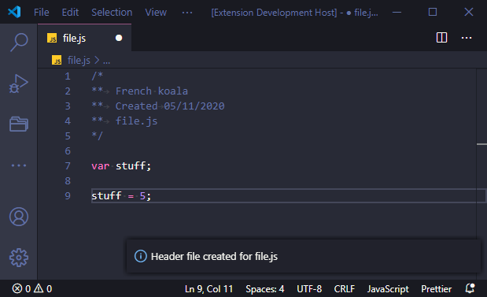
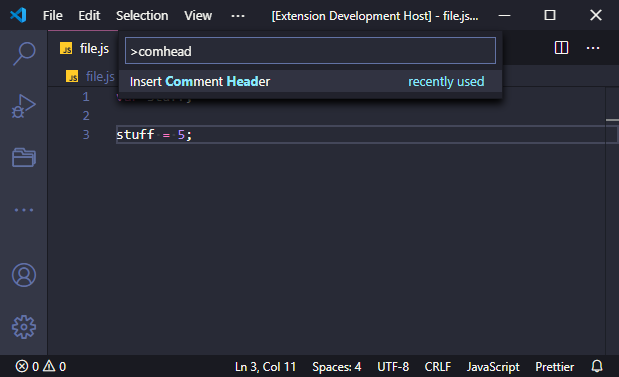

# My Header

# Introduction

This tool writes a simple comment header to the current window with some useful information.

## Features

Writes a comment header containing the user name, the current date and the file name.

It should not insert headers on files starting with comments.

**Supports:**

- C
- C++
- CSS
- Javascript
- Java (untested)
- PHP (untested)
- Swift (untested)
- Any language that uses `/* */` for comments

_Will not function correctly with other programming language, work in progress_

## Usage

### Command Palette

| Command          | Effect                |
| ---------------- | --------------------- |
| `Header Comment` | Insert comment header |
| `hcom`           | Insert comment header |

Example:

> `Header Comment` and `hcom` are equivalent.

## Extension Settings

- `myheader.userName`: user name written in the header.
- `myheader.showDate`: write today's date in the header.

## License

MIT

## Release Notes

[See](CHANGELOG.md)
